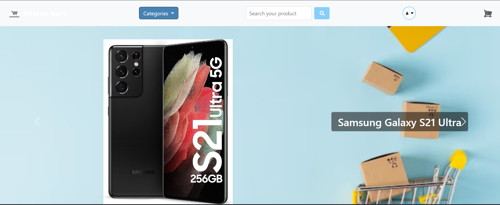

# Amaze-kart
This Amaze-kart is a simple e-commerce website with login authentication and add to cart functionalities.

## Hostel URL

You can visit the website here [Amaze-kart](https://amaze-kart-uf6d.onrender.com)

## Description

- Amaze cart is a basic e-commerce website which contains various types of products with their prices mentioned.
- It lets public to see the products but to add them to cart requires authentication.
- Authentication can be done by username and password or it can be done by Google or Facebook authentication.
- Only after the authentication is done can you access the cart functionalities.

## Features Implemented

## Frontend
- Categories dropdown
- Search bar for products
- Login/Register
- Logout

## Backend
- Authentication by Google and Facebook
- MonogDB database

## Technologies used

- NodeJS
- ExpressJS
- Passport authentication
- MongoDB

## Screenshots

## Homepage

## Products by Category

## Specific Product

## Search bar usage

## Login page

##Register page

## Cart

